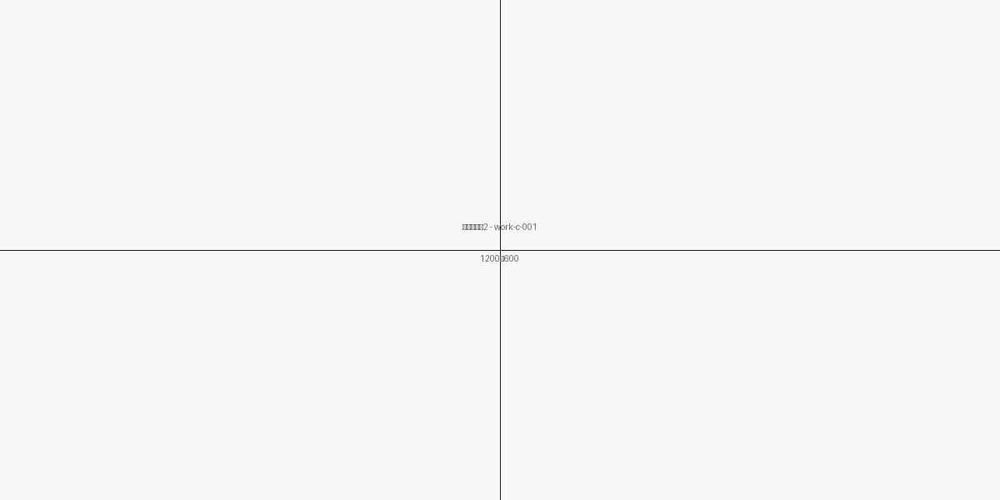
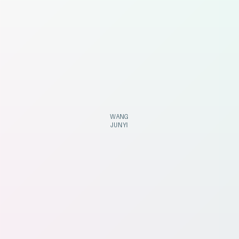

# 图片资源管理指南

## 目录结构

```
images/
├── works/                  # 作品缩略图 (需要自定义)
│   ├── work-c-001.png     # 活动新闻缩略图
│   ├── work-c-002.png     # 专题宣传缩略图
│   ├── ... (共15张)
│
├── details/                # 作品详情页图片 (需要自定义)
│   ├── work-c-001-detail-1.png
│   ├── work-c-001-detail-2.png
│   ├── ... (多张详情图)
│
├── avatars/                # 头像和人物图片 (需要自定义)
│   └── avatar.png         # 个人头像 (400×400)
│
├── bg/                     # 背景素材 (已自动生成)
│   ├── hero-bg.png        # 首屏背景 (1920×1080)
│   └── divider-bg.png     # 分割线背景 (1920×200)
│
└── icons/                  # 图标资源 (已自动生成)
    ├── email.svg
    ├── phone.svg
    ├── arrow-right.svg
    └── external-link.svg
```

---

## 需要自定义的图片资源

### 1. 作品缩略图 (`images/works/`)

**规格**：1200×800px, PNG格式  
**总数**：15张

#### 文化宣传类 (6张)

| 文件名 | 对应作品 | 说明 |
|-------|---------|------|
| `work-c-001.png` | 英语演讲比赛新闻 | 演讲比赛活动场景或相关视觉 |
| `work-c-002.png` | 大国外交专题 | 外交或校园相关视觉 |
| `work-c-003.png` | 企业文化访谈 | 访谈、人物或企业办公场景 |
| `work-c-004.png` | 抗疫志愿者通讯 | 志愿者、疫情防控相关视觉 |
| `work-c-005.png` | 香氛礼盒产品文案 | 产品图片或包装设计 |
| `work-c-006.png` | 营销文案集 | 活动图片或产品展示 |

#### 社区内容类 (3张)

| 文件名 | 对应作品 | 说明 |
|-------|---------|------|
| `work-s-001.png` | Real Estate UGC | 房产相关配图 |
| `work-s-002.png` | Food UGC | 美食相关配图 |
| `work-s-003.png` | 运营体系搭建 | 运营流程图或系统示意图 |

#### 语言服务类 (3张)

| 文件名 | 对应作品 | 说明 |
|-------|---------|------|
| `work-l-001.png` | 国际新闻编译 | CCTV播出画面或新闻截图 |
| `work-l-002.png` | 产品翻译 | 中英文对比或产品图片 |
| `work-l-003.png` | 文学翻译 | 书籍或文学相关视觉 |

#### 其他作品类 (3张)

| 文件名 | 对应作品 | 说明 |
|-------|---------|------|
| `work-o-001.png` | 现代诗创作 | 诗集、手稿或相关艺术 |
| `work-o-002.png` | 学术研究 | 论文、研究报告截图 |
| `work-o-003.png` | 视觉设计 | 设计作品或创意视觉 |

**建议**：
- 使用作品的代表性配图、排版截图或创意海报
- 保持色调统一，符合极简风格
- 确保图片清晰，适配1200×800展示
- 可使用品牌色调做简单处理

---

### 2. 作品详情页图片 (`images/details/`)

**规格**：1200×600px, PNG格式  
**总数**：13张+（可扩展）

#### 部分作品有多张详情图

| 作品ID | 图片数量 | 用途 |
|-------|--------|------|
| `work-c-001-detail-1.png` | 1张 | 新闻原文或活动照片 |
| `work-c-001-detail-2.png` | 1张 | 补充说明或细节图 |
| `work-c-002-detail-1.png` | 1张 | 稿件截图或内容呈现 |
| `work-c-003-detail-1.png` | 1张 | 访谈稿或对话记录 |
| `work-c-004-detail-1.png` | 1张 | 人物或故事配图 |
| `work-c-005-detail-1.png` | 1张 | 产品实拍图 |
| `work-c-005-detail-2.png` | 1张 | 产品细节或包装 |
| `work-c-006-detail-1.png` | 1张 | 营销物料或海报 |
| `work-s-001-detail-1.png` | 1张 | 内容示例 |
| `work-s-002-detail-1.png` | 1张 | 内容示例 |
| `work-s-003-detail-1.png` | 1张 | 系统流程图 |
| `work-l-001-detail-1.png` | 1张 | CCTV播出截图 |
| `work-l-001-detail-2.png` | 1张 | 编译稿件截图 |

**建议**：
- 作品的高清配图或完整呈现
- 支持排版、设计或内容展示
- 多张详情图可展现作品不同侧面
- 可添加截图或设计稿

---

### 3. 个人头像 (`images/avatars/`)

**文件**：`avatar.png`  
**规格**：400×400px, PNG格式（支持透明背景）  
**用途**：关于我区、个人介绍等位置

**建议**：
- 正式、专业的个人照片
- 白色或透明背景
- 清晰、高像素、无压缩
- 可选：简洁的圆形剪裁

---

## 已自动生成的图片资源

### 1. 背景素材 (`images/bg/`)

#### `hero-bg.png` (1920×1080px)
- 首屏Hero区背景
- 浅色渐变风格
- 无损PNG格式
- 可自定义替换

#### `divider-bg.png` (1920×200px)
- 板块分割线背景
- 浅色设计
- 可用于版面装饰

**说明**：这些资源已生成，保持极简风格。如需修改，可直接替换PNG文件。

---

### 2. 图标资源 (`images/icons/`)

已生成的SVG图标（矢量格式，可任意缩放）：

- **`email.svg`** - 邮箱图标
- **`phone.svg`** - 电话图标
- **`arrow-right.svg`** - 右箭头
- **`external-link.svg`** - 外链图标

**特点**：
- SVG格式，文件小
- 可任意改变颜色、大小
- 支持CSS控制样式
- 响应式完美适配

**使用方式**：
```html

<!-- 或 -->
<svg class="icon" ...><use xlink:href="images/icons/email.svg#..."></use></svg>
```

---

## 替换图片的步骤

### 1. 替换作品缩略图

1. 准备新的作品缩略图（1200×800px, PNG）
2. 重命名为对应的 `work-{id}.png`
3. 放入 `images/works/` 文件夹
4. 覆盖原占位符图片

示例：
```bash
# 使用 Finder 或终端
cp ~/Downloads/my-work-thumbnail.png images/works/work-c-001.png
```

### 2. 替换详情页图片

1. 准备详情页图片（1200×600px, PNG）
2. 重命名为 `{work-id}-detail-{序号}.png`
3. 放入 `images/details/` 文件夹
4. 在HTML中添加对应的图片标签

示例：
```html
<div class="detail-images">
    
    
</div>
```

### 3. 替换个人头像

1. 准备个人头像（推荐400×400px, PNG）
2. 重命名为 `avatar.png`
3. 放入 `images/avatars/` 文件夹
4. 在HTML中引用

示例：
```html

```

---

## 图片优化建议

### 1. 文件格式

- **PNG**：无损压缩，适合插图、截图、设计稿
- **JPG**：有损压缩，适合照片、复杂图像（减小文件大小）
- **WebP**：现代格式，更小尺寸，但浏览器兼容性考虑
- **SVG**：矢量图标，文件小，推荐用于图标

### 2. 文件大小优化

- 作品缩略图：80-150KB
- 详情页图片：100-200KB
- 头像：30-80KB
- 背景：150-300KB

**优化工具**：
- TinyPNG / TinyJPG
- ImageOptim (Mac)
- Compressor.io
- 在线WebP转换

### 3. 响应式图片

考虑使用 `srcset` 提供不同尺寸：
```html

```

### 4. 图片懒加载

使用 `loading="lazy"` 属性：
```html

```

---

## 图片使用建议

### 作品缩略图风格

建议统一的视觉风格：
- 主色调：黑白灰 + 浅蓝色
- 避免过多装饰，突出作品内容
- 可使用排版、文字、配图结合
- 保持高度专业感

### 详情页图片

- 原始稿件、设计稿、播出截图
- 支持并排对比（如中英文翻译对比）
- 可包含标注、强调信息
- 确保清晰可读

### 个人头像

- 正式、亲切、专业
- 白色或极简背景
- 清晰五官，表情自然
- 避免过度修饰

---

## 后续维护

### 添加新作品

当添加新作品时：
1. 在 `images/works/` 添加缩略图：`work-{category}-{id}.png`
2. 在 `images/details/` 添加详情图：`work-{id}-detail-{n}.png`
3. 更新 HTML 或数据配置文件
4. 更新作品数据（JSON或JavaScript）

### 批量替换

如需批量替换所有图片：
```bash
# 备份原图片
cp -r images/works images/works-backup

# 替换为新图片（保持同名）
cp ~/path/to/new-images/* images/works/
```

---

## 注意事项

- ✅ 始终保持文件名对应一致
- ✅ 定期备份原始图片
- ✅ 测试图片在不同设备上的显示
- ✅ 检查图片加载速度（PageSpeed等工具）
- ❌ 不要删除原始SVG图标
- ❌ 不要改变 `images/icons/` 中的文件名

---

**文档版本**：v1.0  
**最后更新**：2026年3月
